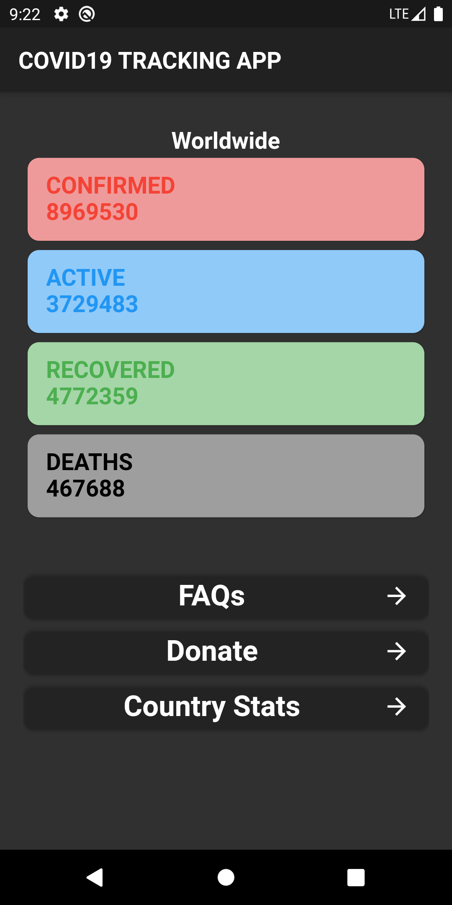
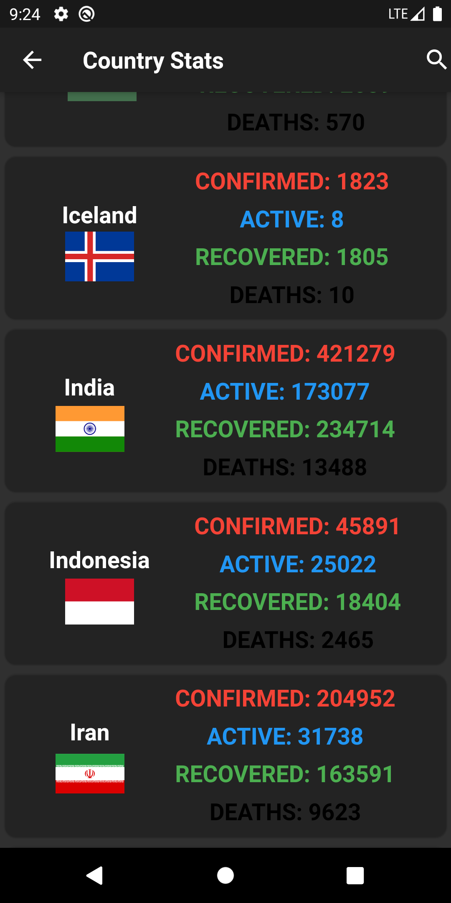
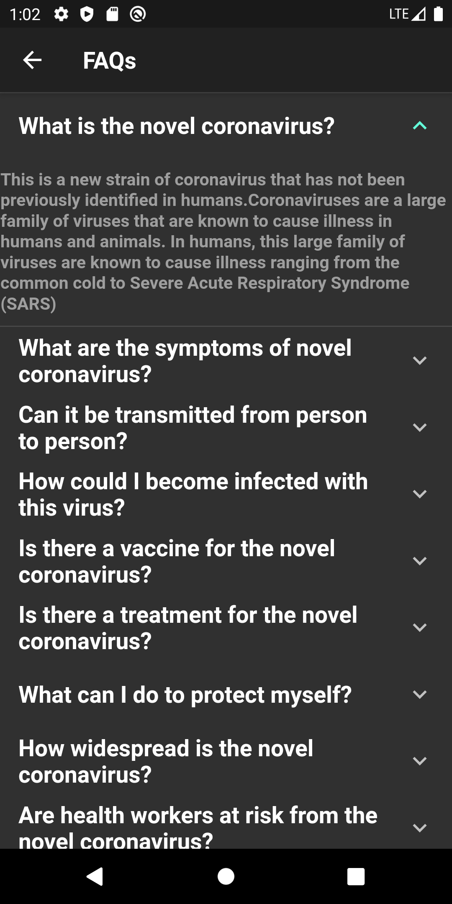
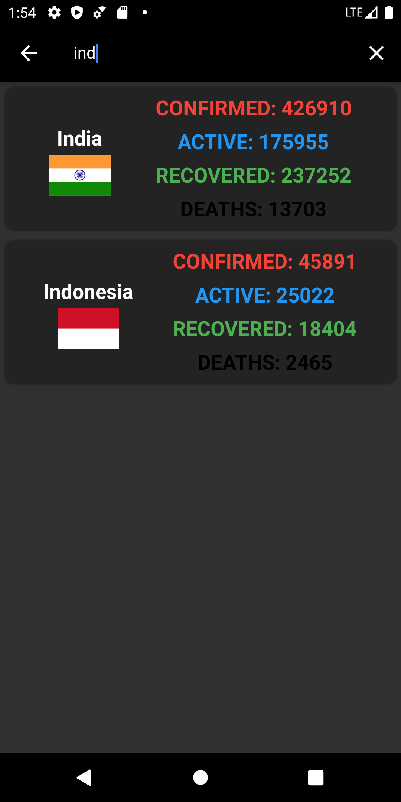

## COVID19 Tracking App

A COVID19 Tracking App Which is made using Dart and Flutter.
The APIs Used Can Be Found [Here](https://corona.lmao.ninja/) 

## Features

- Worldwide Stats (The Figures Updates Every 10 Min).
- Countrywise Stats (The Figures Updates Every 10 Min).
- Real Time Search Results.
- Consist Of FAQs.
- Donate For The Nobel Cause In One Click.

## Images

## Getting Started

This project is a starting point for a Flutter application.

A few resources to get you started if this is your first Flutter project:

- [Lab: Write your first Flutter app](https://flutter.dev/docs/get-started/codelab)
- [Cookbook: Useful Flutter samples](https://flutter.dev/docs/cookbook)

For help getting started with Flutter, view our
[online documentation](https://flutter.dev/docs), which offers tutorials,
samples, guidance on mobile development, and a full API reference.
